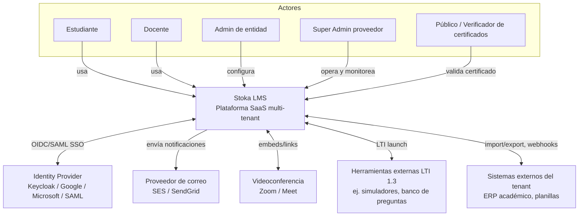
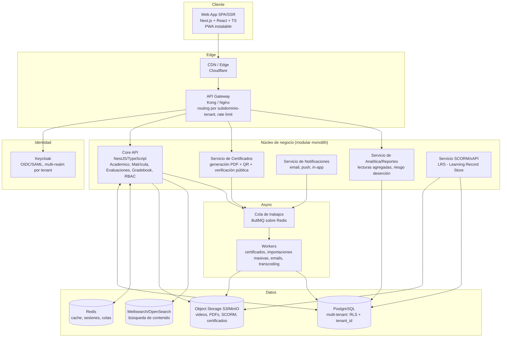

# 1. Arquitectura de alto nivel

## 1.1 Vista de contexto (C4 - Nivel 1)



## 1.2 Vista de contenedores (C4 - Nivel 2)



**Nota de diseño**: se propone un *monolito modular* (Core API) en vez de microservicios desde el día uno. Certificados, Notificaciones y SCORM/LRS se separan como servicios independientes porque tienen ciclos de carga y de despliegue distintos (procesamiento por lotes, picos por fin de periodo académico) y porque son candidatos naturales a extraerse primero si el sistema crece. Ver [ADR-002](adr/ADR-002-stack-backend.md).

## 1.3 Stack tecnológico propuesto

| Capa | Elección | Alternativas descartadas | Motivo |
|---|---|---|---|
| Frontend | Next.js 14+ (React, TypeScript), TailwindCSS, TanStack Query | Angular, Vue/Nuxt | Mayor ecosistema de componentes accesibles (Radix/shadcn), soporte SSR+PWA nativo, comparte tipos con backend TS |
| Backend | NestJS (Node.js, TypeScript) | Django/DRF (Python), Laravel (PHP) | Tipado end-to-end con el frontend, arquitectura modular con decoradores (natural para *feature flags* por módulo y guards de RBAC), buen soporte async/colas. Django se descarta por partir el lenguaje del frontend y por menor ergonomía para *multi-tenancy* dinámica; Laravel es viable pero el equipo objetivo y el ecosistema de paquetes EdTech (LTI, SCORM) es más fuerte en Node/Python |
| Base de datos | PostgreSQL 15+ | MySQL, MongoDB | Row-Level Security nativo (clave para el aislamiento multi-tenant), JSONB para campos flexibles (rúbricas, respuestas de examen), soporte maduro de esquemas múltiples si se necesita aislar tenants grandes |
| Cache | Redis | Memcached | También sirve como *broker* de colas (BullMQ) y almacén de sesiones/feature flags, evita un componente adicional |
| Colas / async | BullMQ sobre Redis | RabbitMQ, AWS SQS | Suficiente para el volumen esperado, se integra nativamente en Node, con reintentos/backoff y colas priorizadas (ej. generación de certificados con prioridad baja) |
| Almacenamiento de archivos | S3 (o MinIO self-hosted) | Almacenamiento en filesystem del servidor | Necesario para escalar horizontalmente sin estado local; MinIO permite despliegues on-prem para tenants con requisitos de soberanía de datos |
| Búsqueda | Meilisearch | Elasticsearch/OpenSearch | Mucho más simple de operar para el volumen de un LMS (búsqueda de cursos/contenido), Elasticsearch se reserva como upgrade si se necesita analítica de logs a gran escala |
| Identidad / SSO | Keycloak | Auth0, Firebase Auth, autenticación custom | Open source, soporta *multi-realm* (mapea 1:1 con tenants o con grupos de tenants), SAML + OIDC nativos, evita reinventar SSO empresarial que piden universidades. Ver [ADR-003](adr/ADR-003-auth-identity.md) |
| RBAC / políticas | Casbin (embebido en Core API) | Open Policy Agent (OPA), tablas de permisos custom | Soporta modelo RBAC con "dominios" (tenant, curso) de forma nativa, corre embebido sin latencia de red adicional. Ver [ADR-005](adr/ADR-005-rbac-engine.md) |
| SCORM/xAPI | scorm-again (player) + Learning Locker (LRS) | Desarrollo propio de reproductor SCORM | Ambos son open source maduros, evita reimplementar el estándar SCORM 1.2/2004 |
| Generación de certificados | Playwright headless (HTML→PDF) + qrcode | wkhtmltopdf, LaTeX | Permite diseñar plantillas de certificado en HTML/CSS editable por el propio tenant (WYSIWYG), reutilizando el motor de render del navegador |
| Contenedores/orquestación | Docker + Kubernetes (EKS/GKE) | Serverless puro (Lambda/Cloud Run functions) | El dominio tiene procesos con estado y larga duración (transcoding, generación masiva de certificados) que encajan mejor en contenedores long-running; Cloud Run/Fargate se usa igual para el MVP para reducir operación (ver sección 7) |
| CI/CD | GitHub Actions + Helm/ArgoCD | Jenkins, GitLab CI | Integración directa con el repositorio, sin infraestructura adicional que mantener |
| Observabilidad | OpenTelemetry + Prometheus + Grafana + Loki + Sentry | Datadog, New Relic | Stack 100% open source, Datadog/New Relic quedan como opción de "comprar" cuando el volumen de tenants justifique el gasto |

## 1.4 Estrategia multi-tenant

Se evalúan tres modelos (terminología del AWS SaaS Lens):

| Modelo | Descripción | Aislamiento | Costo operativo | Escalabilidad |
|---|---|---|---|---|
| **Silo** (BD/esquema por tenant) | Cada tenant tiene su propia base de datos o esquema | Máximo | Alto (N migraciones, N conexiones) | Mala para miles de tenants pequeños |
| **Pool** (fila discriminada, `tenant_id`) | Todos los tenants comparten tablas, columna `tenant_id` + Row-Level Security | Medio-alto (reforzado por RLS) | Bajo | Excelente |
| **Bridge/Híbrido** | Pool por defecto, con opción de mover un tenant a esquema/BD dedicada | Configurable | Medio | Excelente |

**Decisión: modelo híbrido (bridge)**, con **pool + PostgreSQL Row-Level Security como default** para academias e institutos pequeños/medianos, y **esquema o base de datos dedicada** como *opt-in* para universidades grandes (50,000+ usuarios) o clientes con requisitos contractuales de aislamiento físico. Justificación completa en [ADR-001](adr/ADR-001-multi-tenancy.md).

Mecanismo técnico del modelo *pool*:

```sql
-- Cada tabla de negocio incluye tenant_id
ALTER TABLE courses ENABLE ROW LEVEL SECURITY;

CREATE POLICY tenant_isolation_courses ON courses
    USING (tenant_id = current_setting('app.current_tenant')::uuid);

-- En cada conexión/transacción, el Core API fija el tenant activo:
-- SET LOCAL app.current_tenant = '<uuid-del-tenant-resuelto-por-JWT/subdominio>';
```

Resolución del tenant en cada request: subdominio (`academia.stokalms.com`) o dominio custom → tabla `tenant_domains` → `tenant_id` → claim de JWT verificado contra el mismo `tenant_id` → `SET LOCAL app.current_tenant`. Esto evita que un bug de aplicación filtre datos entre tenants, porque la propia base de datos rechaza filas fuera del tenant activo, incluso si el desarrollador olvida un `WHERE tenant_id = ...`.

## 1.5 Feature flags por tenant

Tabla `tenant_features` (`tenant_id`, `feature_key`, `enabled`, `config jsonb`) evaluada en middleware del Core API y cacheada en Redis (invalidada al guardar cambios desde el panel de administración del tenant). Cada plan comercial (Básico/Pro/Enterprise) mapea a un conjunto default de features, editable manualmente para excepciones comerciales.
