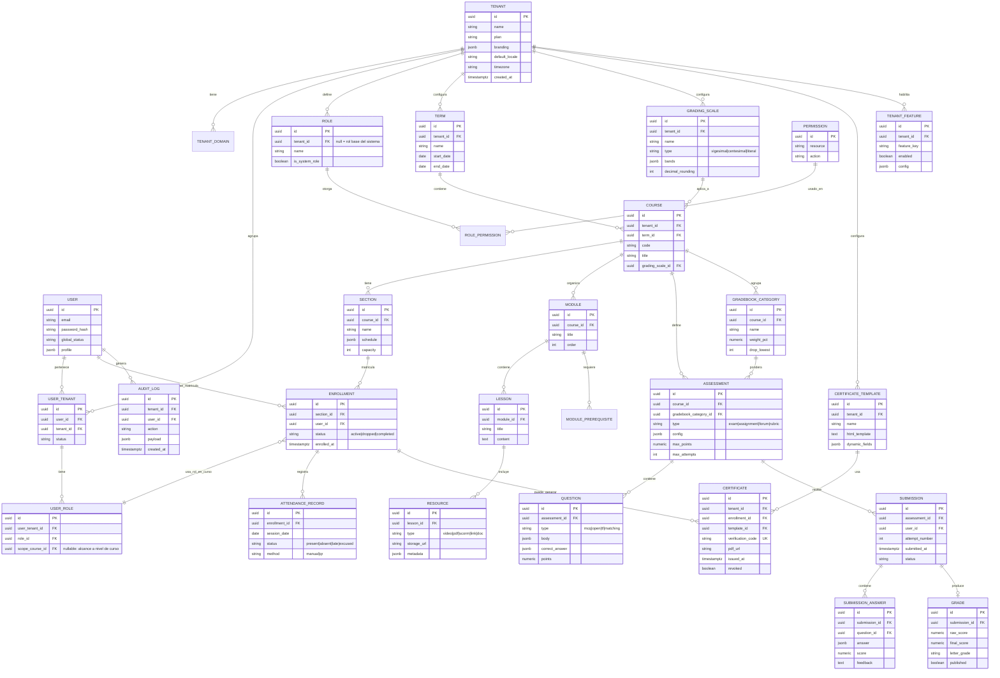

# 2. Modelo de datos

Todas las tablas de negocio (excepto catálogos globales del proveedor) incluyen `tenant_id` como discriminador y quedan sujetas a Row-Level Security (ver [01](01-arquitectura-alto-nivel.md#14-estrategia-multi-tenant)).

## 2.1 Diagrama entidad-relación (núcleo)

## 2.2 Notas de diseño relevantes

- **`USER` es global, `USER_TENANT` es la membresía**: una misma persona (mismo email/identidad) puede pertenecer a varios tenants (ej. un docente que dicta en dos institutos distintos) sin duplicar cuentas. La tabla `USER_TENANT` es la que carga `tenant_id` y por tanto queda sujeta a RLS; `USER` vive en un esquema "global" fuera de RLS por tenant (accesible solo por el Core API para resolución de identidad, nunca expuesto tal cual vía API a un tenant).
- **`USER_ROLE.scope_course_id` nullable** resuelve el requerimiento "mismo usuario con roles distintos en cursos distintos": un rol puede asignarse a nivel de tenant completo (`scope_course_id = null`, ej. Admin de entidad) o acotado a un curso/sección específico (ej. Docente en el curso X, Estudiante en el curso Y).
- **`GRADING_SCALE` y `CERTIFICATE_TEMPLATE` son de tenant, no globales**: cada entidad educativa define sus propias escalas (vigesimal/centesimal/literal) y plantillas, sin tocar código ni pedir soporte.
- **`CERTIFICATE.verification_code` es único globalmente** (no solo por tenant) porque la URL/QR pública de verificación (`stokalms.com/verify/{code}`) no lleva contexto de tenant en la ruta.
- **Campos `jsonb`** (`branding`, `config`, `bands`, `dynamic_fields`, `payload`) se usan deliberadamente para configuración específica de tenant que cambia de forma más ágil que el esquema relacional (colores de marca, bandas de nota, campos dinámicos de certificado), evitando migraciones por cada nueva opción de personalización.
- **`AUDIT_LOG`** registra acciones sensibles (cambios de nota, emisión/revocación de certificado, cambios de permisos, exportaciones) — requerido por la Ley N° 29733 (Perú) y equivalentes (GDPR) para trazabilidad de tratamiento de datos personales.
