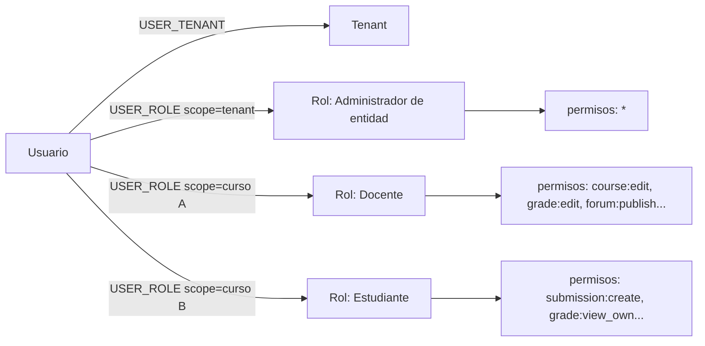

# 3. Diseño del sistema RBAC

## 3.1 Modelo conceptual

Permisos expresados como pares **`recurso:acción`** (ej. `course:create`, `grade:edit`, `certificate:revoke`, `forum:publish`). Los roles agrupan permisos; un usuario obtiene permisos efectivos por la **unión** de todos los roles que tiene asignados, evaluados en el **alcance** (`scope`) correspondiente: tenant completo o curso/sección específico.



## 3.2 Roles base del sistema (`is_system_role = true`)

| Rol | Alcance típico | Notas |
|---|---|---|
| Super Admin | Global (proveedor) | Gestiona tenants, planes, feature flags, salud de la plataforma. No accede a contenido académico de un tenant salvo soporte auditado |
| Administrador de entidad | Tenant | Configura branding, escalas, roles custom, usuarios, planes de módulos |
| Coordinador académico | Tenant o facultad/sede | Gestiona periodos, cursos, matrícula masiva, reportes |
| Docente | Curso/sección | Crea contenido, evalúa, califica, publica notas y certificados de sus cursos |
| Estudiante | Curso/sección (como matriculado) | Consume contenido, entrega evaluaciones, ve sus notas y certificados |
| Padre/Apoderado (opcional) | Solo lectura, vinculado a un estudiante | Ve progreso/notas/asistencia del hijo/pupilo, sin acceso a contenido |
| Auditor/Invitado | Tenant, solo lectura | Para acreditaciones o revisiones externas |

Estos roles **no son editables ni eliminables**, pero sus permisos por defecto sí pueden ajustarse dentro de un tenant (ver 3.3) para no romper el onboarding cuando un tenant necesita, por ejemplo, que el Docente no pueda eliminar entregas.

## 3.3 Roles y permisos personalizados por tenant

Cada tenant puede:
1. Clonar un rol base y ajustar su matriz de permisos (por módulo × acción: ver/crear/editar/eliminar/calificar/publicar).
2. Crear roles completamente nuevos (ej. "Tutor de práctica", "Secretaría académica") con una combinación arbitraria de permisos.
3. Asignar cualquier rol (base o custom) con alcance de tenant o de curso.

La matriz de permisos se renderiza en el panel de administración como una tabla módulo × acción con checkboxes — no requiere tocar código ni pedir soporte al proveedor, cumpliendo el requisito de personalización self-service.

## 3.4 Motor de evaluación: Casbin con modelo RBAC + dominios

Se adopta [Casbin](https://casbin.org/) embebido en el Core API, usando su modelo **RBAC con dominios/tenants** (`g2 = _, _, _` con dominio = `tenant_id` o `tenant_id:course_id`). Justificación completa en [ADR-005](adr/ADR-005-rbac-engine.md).

Modelo Casbin (`model.conf`):

```ini
[request_definition]
r = sub, dom, obj, act

[policy_definition]
p = sub, dom, obj, act

[role_definition]
g = _, _, _

[policy_effect]
e = some(where (p.eft == allow))

[matchers]
m = g(r.sub, p.sub, r.dom) && r.dom == p.dom && r.obj == p.obj && r.act == p.act
```

- `dom` (dominio) toma el valor `tenant:{tenant_id}` para permisos a nivel de tenant, o `course:{course_id}` para permisos acotados a un curso. La resolución de "¿tiene el usuario X permiso Y en el dominio Z?" cae siempre en una consulta O(1) contra las políticas cacheadas en memoria/Redis (Casbin soporta *watcher* sobre Redis para invalidar cache entre réplicas cuando un admin cambia permisos).
- Las políticas (`p`) se generan dinámicamente a partir de las tablas `ROLE`, `PERMISSION`, `ROLE_PERMISSION` (fuente de verdad relacional, para que el panel de administración siga siendo CRUD normal); Casbin solo actúa como **motor de evaluación en runtime**, no como fuente de verdad.
- Alternativa descartada: **Open Policy Agent (OPA)** — más potente para políticas ABAC complejas (ej. "solo si es horario de examen y el estudiante está en la sede X"), pero introduce latencia de red (sidecar) y complejidad operativa no justificada para el alcance actual. Se deja como posible evolución si en fases futuras se requieren políticas condicionadas por atributos dinámicos (geolocalización, ventana horaria de examen).

## 3.5 Resolución de permisos en un request típico

```mermaid
sequenceDiagram
    participant C as Cliente (Web)
    participant GW as API Gateway
    participant API as Core API
    participant CAS as Casbin (in-memory)
    participant DB as PostgreSQL

    C->>GW: PATCH /api/v1/courses/{id}/grades/{gradeId}
    GW->>API: forward + JWT (sub, tenant_id)
    API->>API: Guard RBAC: resuelve dom = course:{courseId}
    API->>CAS: enforce(userId, dom, "grade", "edit")
    CAS-->>API: allow / deny
    alt allow
        API->>DB: SET LOCAL app.current_tenant; UPDATE grades...
        DB-->>API: OK
        API->>DB: INSERT audit_log(action=grade:edit)
        API-->>C: 200 OK
    else deny
        API-->>C: 403 Forbidden
    end
```

Doble capa de seguridad: Casbin decide **qué puede hacer**, y PostgreSQL RLS garantiza **sobre qué filas** puede hacerlo, incluso si la capa de aplicación tuviera un bug.
