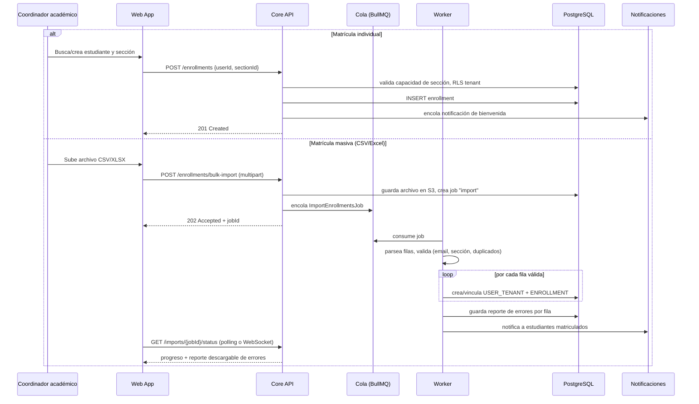
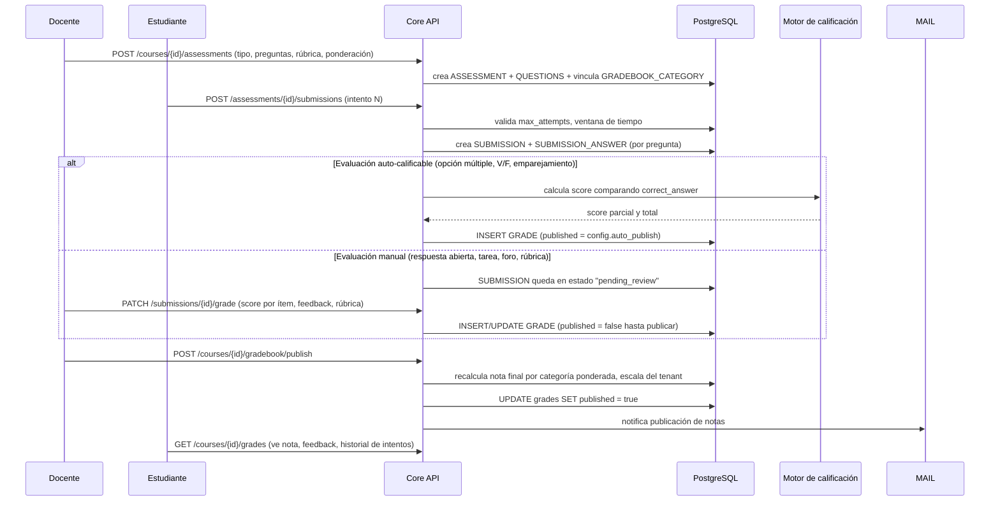
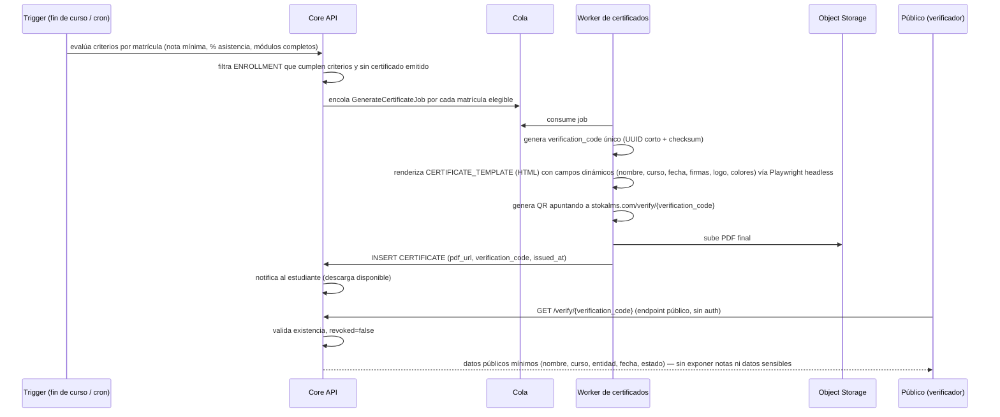

# 4. Flujos críticos

## 4.1 Matrícula (individual y masiva)

Consideraciones:
- La importación masiva corre en un **worker asíncrono**, nunca en el request HTTP, porque un CSV de miles de filas (típico en matrícula de universidad) excede tiempos razonables de respuesta HTTP.
- Errores por fila (email inválido, sección llena, duplicado) se acumulan en un **reporte descargable** en vez de abortar todo el lote (importación *best-effort* con detalle de fallos).
- Integración con sistemas externos (SIS/ERP del tenant) reutiliza el mismo endpoint `bulk-import` vía webhook/API, o un conector dedicado en fases posteriores (ver [roadmap](06-roadmap.md)).

## 4.2 Ciclo de evaluación y calificación

Reglas de negocio clave:
- **Ponderación por categoría**: `nota_final_curso = Σ (promedio_categoria_i × weight_pct_i)`, con soporte de `drop_lowest` (descarta las N notas más bajas de una categoría, típico en "prácticas calificadas").
- **Política de recuperación**: configurable por curso (ej. "el examen de recuperación reemplaza la nota más baja del rubro Exámenes"), modelada como una regla adicional evaluada en el mismo paso de recálculo, no como caso especial hardcodeado.
- **Redondeo y escala**: aplicados en el último paso, usando `GRADING_SCALE` del curso (vigesimal/centesimal/literal + `decimal_rounding`), nunca en pasos intermedios, para evitar arrastre de error de redondeo.
- **Historial de intentos**: cada `SUBMISSION` es inmutable una vez enviada; un reintento crea una nueva fila con `attempt_number` incremental, preservando auditoría completa.

## 4.3 Emisión y verificación de certificados

Consideraciones:
- Emisión desacoplada del flujo síncrono: se dispara por cron/evento (cierre de curso, cambio de estado de matrícula a "completed") y se procesa en background, porque generar cientos/miles de PDFs con render headless es costoso.
- **Revocación**: un Admin de entidad puede marcar `revoked = true` (ej. fraude académico detectado); el endpoint público refleja el estado inmediatamente — nunca se borra el registro, por trazabilidad.
- El endpoint de verificación es **público e intencionalmente minimalista**: expone solo lo necesario para validar autenticidad (no debe convertirse en una fuga de datos académicos completos).
