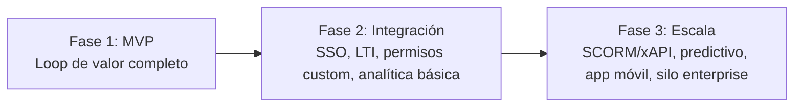

# 6. Roadmap de implementación

Priorización basada en el **loop de valor mínimo** de un LMS: *crear curso → matricular → enseñar/aprender → evaluar → calificar → certificar*. Todo lo que no sostenga ese loop se difiere a fases posteriores, incluso si está en la lista de requerimientos original.

## 6.1 Fase 1 — MVP

**Objetivo**: una entidad educativa pequeña/mediana puede operar de punta a punta sin soporte técnico del proveedor.

- Gestión académica básica: periodos, cursos, secciones, módulos, lecciones, recursos (PDF, video embebido, enlaces).
- Matrícula individual y masiva (CSV/Excel) con reporte de errores.
- Evaluaciones: examen (opción múltiple, V/F, respuesta abierta), tareas con entrega de archivo. Emparejamiento y foros calificables se difieren a fase 2.
- Gradebook configurable: categorías ponderadas, escalas vigesimal/centesimal/literal, redondeo, publicación de notas, historial de intentos.
- Certificados: generación automática por criterios (nota mínima + completitud), plantilla básica editable (logo, colores, texto, firma), verificación pública por QR/URL.
- RBAC: roles base del sistema + edición de matriz de permisos por tenant (sin roles custom nuevos todavía).
- Personalización de tenant: branding (logo/colores), subdominio propio, idioma (es/en), zona horaria, escalas de nota.
- Notificaciones: solo correo (bienvenida, publicación de notas, certificado emitido).
- Onboarding autoguiado: wizard de primeros pasos (crear periodo → curso → matricular → primera evaluación) sin necesidad de soporte.
- i18n: es como idioma por defecto, en como segundo idioma, arquitectura de traducción lista para más.
- Web responsive + PWA instalable (sin app nativa todavía).
- Auditoría básica de acciones sensibles (notas, certificados, permisos).

**Justificación**: cubre el ciclo completo de valor y el requisito explícito de "operable sin conocimientos técnicos", sin invertir aún en integraciones externas (SSO, LTI, SCORM) que solo pagan cuando ya hay tenants activos pidiéndolas.

## 6.2 Fase 2 — Expansión funcional y de integración

- Roles y permisos completamente personalizados (creación de roles custom nuevos, no solo edición de los base).
- Rúbricas de calificación, foros calificables, emparejamiento como tipo de pregunta.
- Mensajería interna docente-estudiante.
- Control de asistencia por QR (la asistencia manual, por sección y fecha, ya está implementada — ver `modules/attendance`).
- Calendario académico integrado con entregas/evaluaciones.
- Notificaciones push + in-app (además de correo).
- Analítica básica: progreso por curso, engagement simple (vistas de recurso, entregas a tiempo vs. tarde).
- SSO institucional self-service (SAML/OIDC contra IdP del tenant vía Keycloak).
- LTI 1.3 como *tool consumer* (embeber herramientas externas dentro de un curso).
- Editor visual de plantillas de certificado y de notificaciones (WYSIWYG, no solo campos predefinidos).
- Prerequisitos de rutas de aprendizaje (bloqueo de módulo hasta completar el anterior).

## 6.3 Fase 3 — Escala, cumplimiento avanzado y diferenciación

- SCORM/xAPI completo con LRS (Learning Locker) para contenido de terceros.
- Analítica predictiva: riesgo de deserción, alertas tempranas a coordinación.
- Integraciones nativas de videoconferencia (creación de sesiones Zoom/Meet desde el curso, no solo enlaces).
- App móvil nativa (iOS/Android) para casos donde PWA no sea suficiente (notificaciones push nativas, uso offline parcial).
- Modelo de aislamiento **silo** (esquema/BD dedicada) disponible como *upgrade* self-service para tenants Enterprise (universidades grandes).
- Marketplace/librería de plantillas de certificado y estructuras de curso reutilizables entre tenants (opt-in).
- Reportes avanzados exportables (por docente, por periodo, comparativos entre sedes).
- Conectores dedicados a SIS/ERP académicos comunes (más allá del CSV genérico).

## 6.4 Resumen de priorización

El criterio de paso entre fases no es una fecha fija, sino: **Fase 1 → Fase 2** cuando existan tenants activos operando el loop completo sin soporte; **Fase 2 → Fase 3** cuando la demanda de tenants grandes (universidades, requisitos SCORM/analítica predictiva) justifique la inversión en infraestructura adicional (LRS, ML, K8s multi-región).
