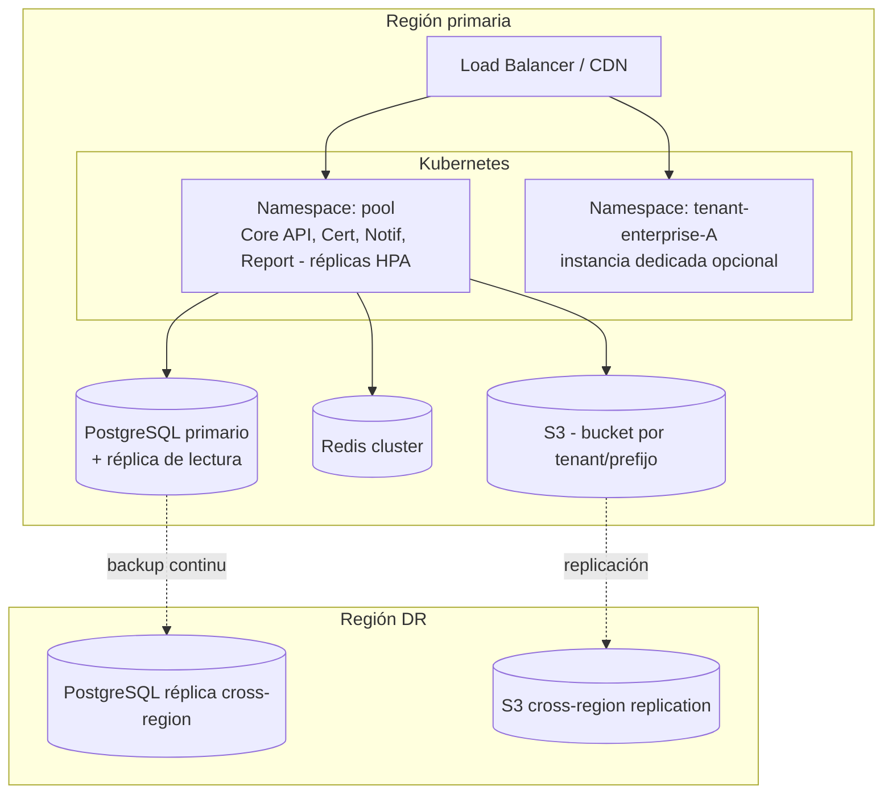
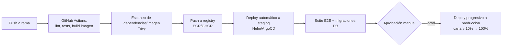

# 7. Infraestructura, despliegue y costos

## 7.1 Estrategia de despliegue por etapa

| Etapa | Plataforma | Motivo |
|---|---|---|
| MVP / pocos tenants | AWS ECS Fargate (o Google Cloud Run) + RDS PostgreSQL managed | Minimiza operación (sin gestionar nodos K8s) mientras el volumen es bajo; contenedores idénticos a los que luego correrán en K8s (mismo Dockerfile) |
| Crecimiento (decenas/cientos de tenants) | Kubernetes gestionado (EKS/GKE) | Necesario cuando se requiere autoscaling fino por servicio (ej. workers de certificados en picos de fin de periodo), *multi-tenancy* de namespaces para tenants silo, y despliegues canary |
| Escala (universidades grandes, multi-región) | K8s multi-región + PostgreSQL con réplicas de lectura por región | Reduce latencia para tenants en distintas zonas geográficas y aísla el *blast radius* de un incidente regional |

La migración Fargate → K8s no exige reescribir la aplicación: los mismos contenedores y manifiestos Helm se validan desde el MVP en un clúster de staging pequeño.

## 7.2 Diagrama de despliegue (etapa de crecimiento)

## 7.3 CI/CD

- Migraciones de base de datos versionadas (ej. Prisma Migrate/Knex), ejecutadas como *job* previo al rollout, nunca embebidas en el arranque de la app.
- Feature flags por tenant permiten activar funcionalidad nueva primero para tenants piloto antes de un rollout general.

## 7.4 Observabilidad

- **Métricas**: Prometheus + Grafana (dashboards por tenant: latencia, error rate, uso de storage, jobs en cola).
- **Logs**: Loki, con `tenant_id` y `trace_id` como campos estructurados obligatorios en cada línea.
- **Trazas**: OpenTelemetry end-to-end (Web → Gateway → Core API → DB/colas).
- **Errores de aplicación**: Sentry.
- **Alertas críticas**: SLO de disponibilidad (99.9%), tasa de error de generación de certificados, profundidad de cola de importación masiva.

## 7.5 Backups y recuperación ante desastres

| Aspecto | Estrategia | Objetivo |
|---|---|---|
| Backups de BD | Point-in-time recovery (WAL continuo) + snapshot diario retenido 30 días | RPO ≤ 5 min |
| Backups de object storage | Versionado + replicación cross-region | RPO ≈ near-zero (replicación async) |
| Recuperación | Runbook documentado, réplica en región DR promovible | RTO objetivo ≤ 1 hora para incidente regional |
| Prueba de restauración | Simulacro trimestral de restauración completa en entorno aislado | Verifica que el backup es realmente restaurable, no solo que existe |

## 7.6 Seguridad y cumplimiento (resumen operativo)

- **Cifrado en tránsito**: TLS 1.2+ en todos los saltos (cliente↔CDN↔Gateway↔servicios↔BD).
- **Cifrado en reposo**: discos/volúmenes de RDS y S3 cifrados (KMS gestionado).
- **Auditoría**: tabla `AUDIT_LOG` (ver [modelo de datos](02-modelo-de-datos.md)) + logs de acceso a infraestructura (quién desplegó qué y cuándo).
- **Protección de datos personales**: minimización de datos en el endpoint público de verificación de certificados, exportación/eliminación de datos personales a solicitud (derechos ARCO de la Ley N° 29733 / derechos GDPR), acuerdos de tratamiento de datos (DPA) por tenant si aplica.
- **Accesibilidad**: pruebas automatizadas (axe-core) en CI + revisión manual de componentes críticos (formularios de examen, gradebook) contra WCAG 2.1 AA.

## 7.7 Estimación de costos aproximados (orden de magnitud, USD/mes, cloud público)

| Escala de tenant | Perfil | Compute | Base de datos | Storage/CDN | Total aprox. |
|---|---|---|---|---|---|
| Pequeña (~50 usuarios, academia) | Recursos compartidos (pool), sin dedicar nada | Incluido en costo base compartido entre varios tenants pequeños | Incluido | Incluido | Costo marginal: **US$ 5–15** por tenant (infraestructura compartida) |
| Mediana (~2,000–5,000 usuarios, instituto) | Aún en pool, con picos de uso propios | ~US$ 80–150 (prorrateado) | ~US$ 50–100 (prorrateado) | ~US$ 20–40 | **US$ 150–300** |
| Grande (50,000+ usuarios, universidad) | Modelo silo/bridge, recursos dedicados | US$ 800–2,000 (nodos dedicados, autoscaling) | US$ 400–800 (instancia dedicada + réplicas) | US$ 150–400 (video/SCORM pesado) | **US$ 1,500–3,500** |

Estos números son órdenes de magnitud para planeamiento inicial, no una cotización — dependen del proveedor cloud, la región y, sobre todo, del volumen real de contenido multimedia (video es históricamente el driver de costo dominante en un LMS, de ahí la recomendación de externalizar transcoding a un servicio especializado en fases posteriores en vez de construirlo in-house desde el MVP).
